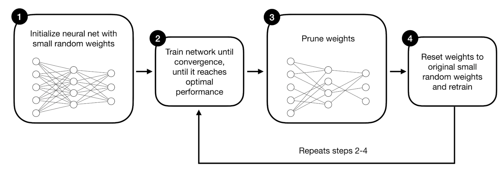

# LTH-pytorch

This repository contains a [Lottery Ticket Hypothesis](https://arxiv.org/pdf/1803.03635.pdf) implementation on single-cell RNA-seq data.

The pruning criteria used for pruning is L1-magnitude based pruning.

## Training data
-----
* Training data (compatible with Merlin Dataloader infrastructure): https://pklab.med.harvard.edu/felix/data/merlin_cxg_2023_05_15_sf-log1p.tar.gz (164GB) 
* Minimal subset of the training, validation and test data: https://pklab.med.harvard.edu/felix/data/merlin_cxg_2023_05_15_sf-log1p_minimal.tar.gz (0.5GB)

## Installation details

Make sure **cudf** is installed 

`pip install -r requirements.txt`

## Implementation details

Main code is in a jupyter notebook called `prune.ipynb`

Ensure `DATA_PATH` is pointed to the downloaded dataset.

The iterative LTH process is implemented using the PyTorch [prune](https://pytorch.org/tutorials/intermediate/pruning_tutorial.html) method.

### Model Architecture

To benchmark against a known standard, the model architecture chosen is from the [ScTab](https://github.com/theislab/scTab/blob/devel/cellnet/models.py) repository.

## First Attempt results - 

| Percent of Weights Remaining | F1-score (Macro)   |
| :---:   | :---: |
| 100 | 83.62   |
| 90 | 83.81   |
| 80 | 83.75   |
| 70 | 83.43   |
| 60 | 83.39   |
| 50 | 83.03   |
| 40 | 82.37   |
| 30 | 81.39   |
| 20 | 79.31   |
| 10 | 75.2   |

## References

* Dataset and Model from [ScTab](https://github.com/theislab/scTab/tree/devel).