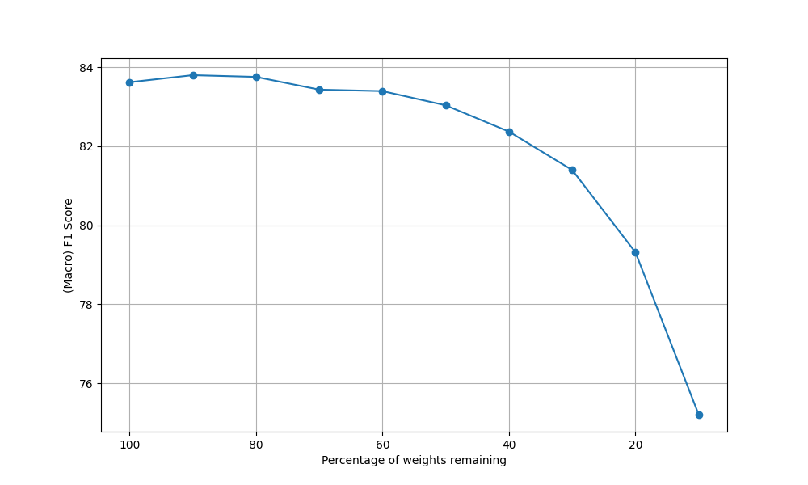

# LTH-pytorch

This repository contains a [Lottery Ticket Hypothesis](https://arxiv.org/pdf/1803.03635.pdf) implementation on single-cell RNA-seq data.

The pruning criteria used for pruning is L1-magnitude based pruning.

## Training data
-----
* Training data (compatible with Merlin Dataloader infrastructure): https://pklab.med.harvard.edu/felix/data/merlin_cxg_2023_05_15_sf-log1p.tar.gz (164GB) 
* Minimal subset of the training, validation and test data: https://pklab.med.harvard.edu/felix/data/merlin_cxg_2023_05_15_sf-log1p_minimal.tar.gz (0.5GB)

## Installation details

Make sure **cudf** is installed 

`pip install -r requirements.txt`

## Implementation details

Main code is in a jupyter notebook called `prune.ipynb`

Ensure `DATA_PATH` is pointed to the downloaded dataset.

## First Attempt results - 

